# GitHub Fish Tank

<div align="center">
  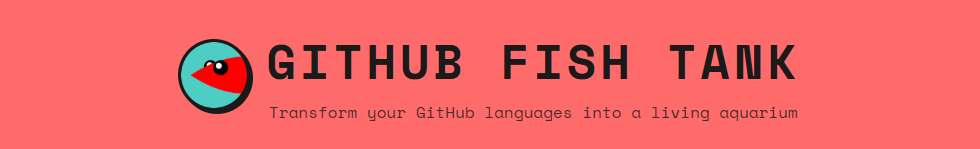
</div>

## Table of Contents
- 🚀 [Project Overview](#project-overview)
- ✨ [Features](#features)
- 💻 [Technologies](#technologies)
- 📋 [Requirements](#requirements)
- 🛠️ [Setup Instructions](#setup-instructions)
- 📖 [Usage](#usage)
- 🐟 [Fish List](#fish-list)
- 📸 [Screenshots](#screenshots)

## Project Overview
GitHub Fish Tank is a web application that transforms your GitHub language statistics into a living, animated aquarium. Each programming language becomes a uniquely shaped and colored fish swimming through a customizable underwater scene. It generates an SVG image that you can embed directly in your GitHub README profile.

> [!IMPORTANT]  
> The public instance at https://gh-fish-tank.vercel.app can be unreliable due to GitHub API rate limits. Self-hosting (Vercel or other) or using the GitHub Actions workflow to generate aquarium in your profile repository is recommended.

> [!TIP]  
> You can download the generated SVG file and add it directly to your repository. This way, your fish tank will work completely offline without depending on the generation service.

> [!NOTE]  
> The application is available in English language version!

[](https://vercel.com/)

## Features
- 🐠 34 Custom-designed fish models for specific programming languages
- 🎨 Customizable aquarium appearance and decorations
- 🏷️ Optional legend and labels displayed on each fish
- 🔗 README-Ready URL generation
- 🚫 Language filtering – hide specific languages from the visualization
- 🖼️ Playful neobrutalist visual style
- 📱 Full responsiveness

## Technologies
**Backend**
- Node.js
- Express
- GitHub REST API
- Vercel Functions

**Frontend**
- HTML
- CSS
- JavaScript

## Requirements
Software versions used for development:
- npm 11.6.4
- Node.js 22.14.0
- Express 4.22.1
> [!WARNING]  
> Compatibility with earlier versions has not been tested.

## Setup Instructions

Just go to [gh-fish-tank.vercel.app](https://gh-fish-tank.vercel.app/).

OR

To run a project locally, you must have Node.js and npm installed. 
> [!IMPORTANT]  
> *Download guide: [Installing Node.js and npm](https://docs.npmjs.com/downloading-and-installing-node-js-and-npm)*

You will also need a GitHub Personal Access Token (optional, but recommended to avoid rate limiting).

1. Download and extract the project folder.
2. Navigate to the project folder in your terminal.
3. Install dependencies:
```
$ npm install
```
4. (Optional) Add `.env` file in the root directory:
```
GITHUB_TOKEN=your_github_personal_access_token_here
```
5. Launch the development server:
```
npm run dev
```
6. Access the application at [http://localhost:3000](http://localhost:3000).

## Usage

Just copy and paste this into your markdown - and you're done!


```md
[](https://github.com/hadoyyo)
```
> [!IMPORTANT]  
> Remember to change username to your own!

Customize every detail of your fish tank - from the background to decorations - with simple URL parameters.

| Name | Description | Type | Default value |
| --- | --- | --- | --- |
| `user` | GitHub username for the languages. | string | *required* |
| `bg` | Background color of the fish tank. | string (hex color) | `#4ecdc4` |
| `frame` | Color of the tank's frame. | string (hex color) | `#3a4a5a` |
| `sand` | Color of the sand at the bottom. | string (hex color) | `#c4a574` |
| `show_legend` | Displays the legend explaining fish (languages and percentage). | boolean | `true` |
| `show_language_labels` | Shows labels for programming languages (under the fish). | boolean | `true` |
| `show_bubbles` | Toggles the bubble animation. | boolean | `true` |
| `show_rocks` | Shows rocks decoration. | boolean | `true` |
| `show_plants` | Shows standard plants. Cannot be displayed together with `show_plants_alt`. | boolean | `true` |
| `show_plants_alt` | Shows alternative plants. Cannot be displayed together with `show_plants`. | boolean | `false` |
| `show_castle` | Shows a castle decoration. Cannot be displayed together with `show_ship`. | boolean | `true` |
| `show_ship` | Shows a sunken ship decoration. Cannot be displayed together with `show_castle`. | boolean | `false` |
| `show_chest` | Shows a treasure chest decoration. Cannot be displayed together with `show_anubias`. | boolean | `true` |
| `show_anubias` | Shows anubias plant. Cannot be displayed together with `show_chest`. | boolean | `false` |
| `show_shell` | Shows shell decoration. Cannot be displayed together with `show_statue`. | boolean | `true` |
| `show_statue` | Shows a statue decoration. Cannot be displayed together with `show_shell`. | boolean | `false` |
| `show_frame` | Toggles the visibility of the tank's frame. | boolean | `true` |
| `hide` | Comma-separated list of programming languages to hide from the tank (URL-encoded). Example: `hide=php%2Cc` hides PHP and C. | string (comma-separated) | *none* |

> [!TIP]  
> The following pairs are mutually exclusive. If both are set to `true`, only the first (default) one will be displayed:
> - `show_plants` / `show_plants_alt` → defaults to `show_plants`
> - `show_castle` / `show_ship` → defaults to `show_castle`
> - `show_chest` / `show_anubias` → defaults to `show_chest`
> - `show_shell` / `show_statue` → defaults to `show_shell`

### Examples

#### Standard Tank

#### Moon Tank with yellow frame

#### Blackwater River

#### Deep Sea Tank

## Fish List
<b>The main color of the fish correspond to the color assigned to each language on GitHub.</b>

List of languages that have a unique fish model:

<table>
  <tr>
    <th>Language</th><th >Preview</th><th style="border-left: 1px solid #424346;">Language</th><th>Preview</th><th style="border-left: 1px solid #424346;">Language</th><th>Preview</th>
  </tr>
  <tr>
    <td>JavaScript</td><td>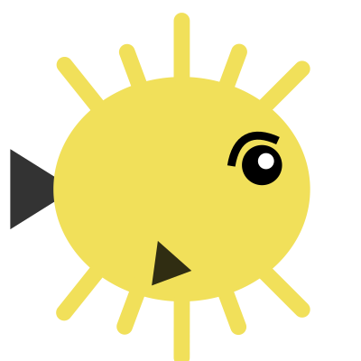</td><td style="border-left: 1px solid #424346;">TypeScript</td><td>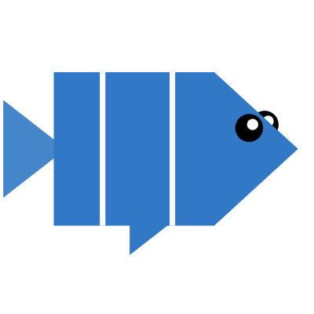</td><td style="border-left: 1px solid #424346;">Python</td><td>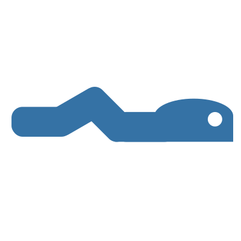</td>
  </tr>
  <tr>
    <td>Java</td><td>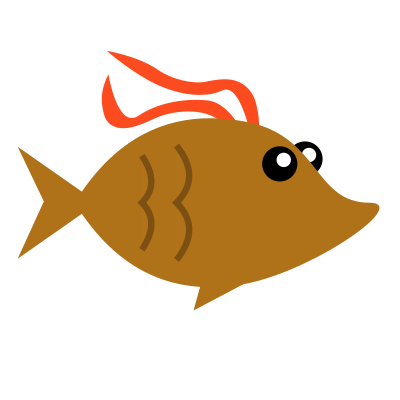</td><td style="border-left: 1px solid #424346;">C++</td><td >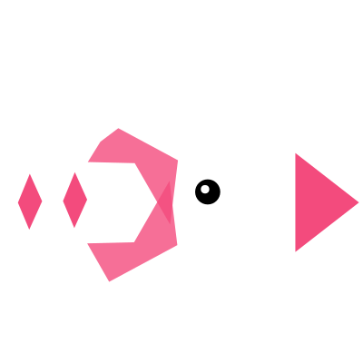</td><td style="border-left: 1px solid #424346;">C#</td><td>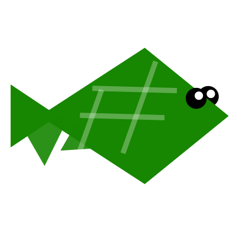</td>
  </tr>
  <tr>
    <td>Go</td><td>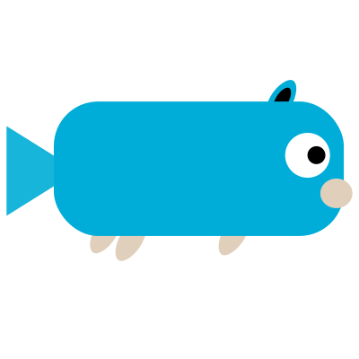</td><td style="border-left: 1px solid #424346;">Rust</td><td>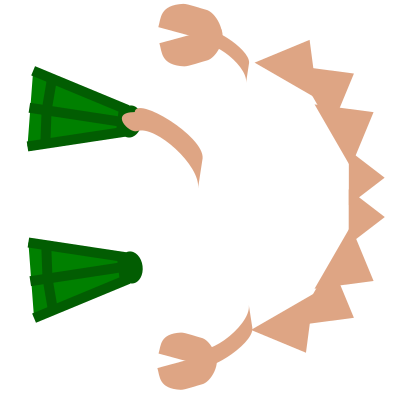</td><td style="border-left: 1px solid #424346;">Ruby</td><td>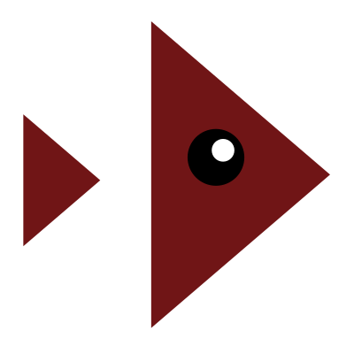</td>
  </tr>
  <tr>
    <td>PHP</td><td>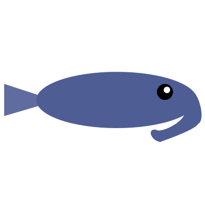</td><td style="border-left: 1px solid #424346;">Swift</td><td>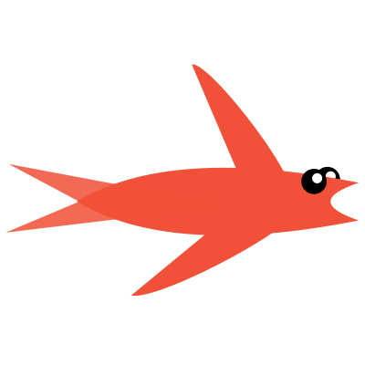</td><td style="border-left: 1px solid #424346;">Kotlin</td><td>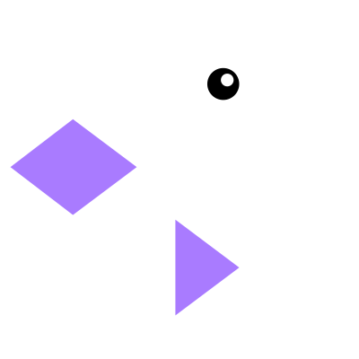</td>
  </tr>
  <tr>
    <td>HTML</td><td>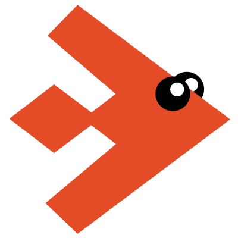</td><td style="border-left: 1px solid #424346;">CSS</td><td>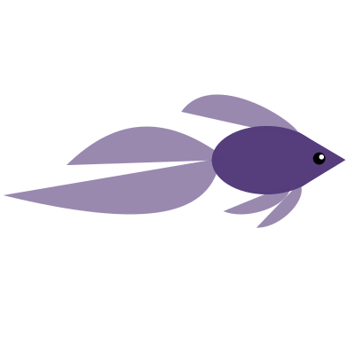</td><td style="border-left: 1px solid #424346;">Shell</td><td>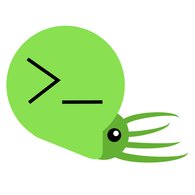</td>
  </tr>
  <tr>
    <td>Vue</td><td>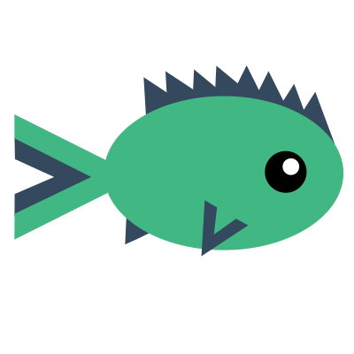</td><td style="border-left: 1px solid #424346;">Dart</td><td>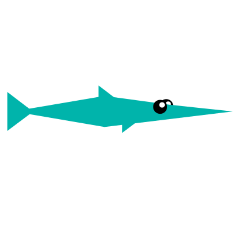</td><td style="border-left: 1px solid #424346;">Scala</td><td>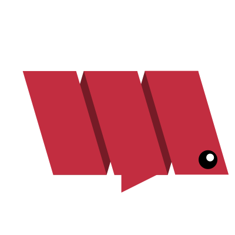</td>
  </tr>
  <tr>
    <td>Haskell</td><td>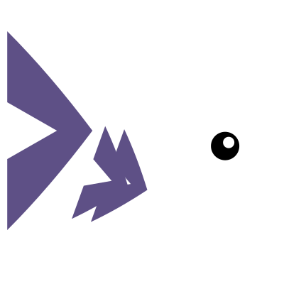</td><td style="border-left: 1px solid #424346;">Elixir</td><td>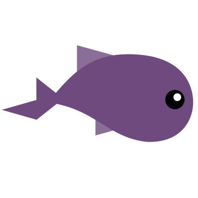</td><td style="border-left: 1px solid #424346;">Clojure</td><td>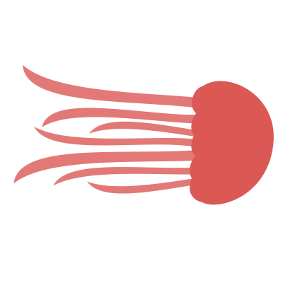</td>
  </tr>
  <tr>
    <td>Lua</td><td>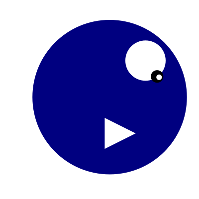</td><td style="border-left: 1px solid #424346;">R</td><td>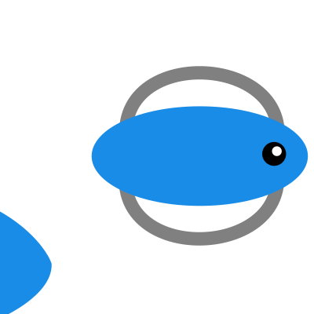</td><td style="border-left: 1px solid #424346;">Dockerfile</td><td>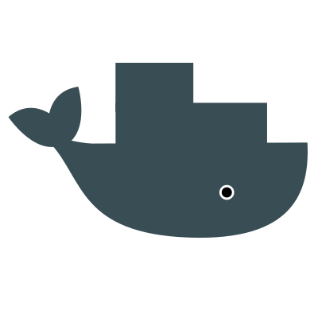</td>
  </tr>
  <tr>
    <td>Perl</td><td>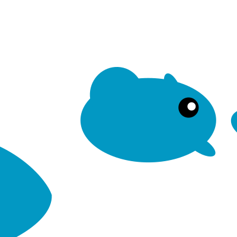</td><td style="border-left: 1px solid #424346;">MATLAB</td><td>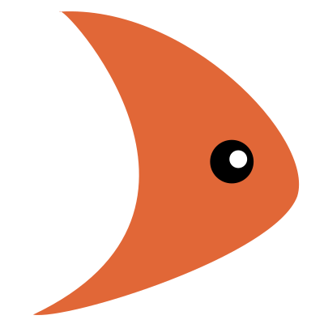</td><td style="border-left: 1px solid #424346;">Erlang</td><td>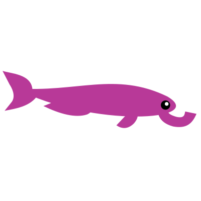</td>
  </tr>
  <tr>
    <td>Julia</td><td>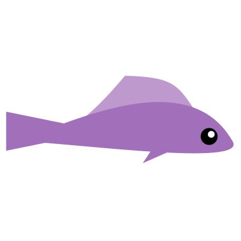</td><td style="border-left: 1px solid #424346;">Jupyter N.</td><td>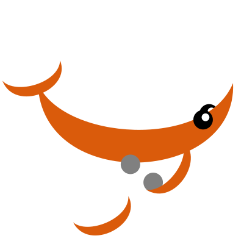</td><td style="border-left: 1px solid #424346;">Vim</td><td>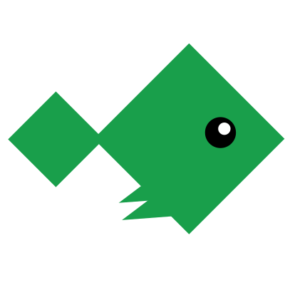</td>
  </tr>
  <tr>
    <td>C</td><td>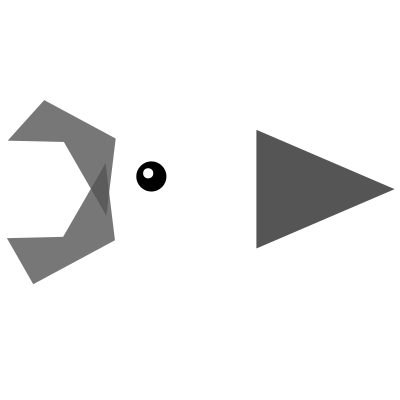</td><td style="border-left: 1px solid #424346;">TeX</td><td>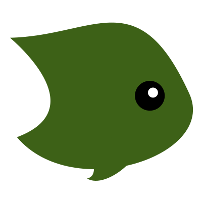</td><td style="border-left: 1px solid #424346;">Nix</td><td>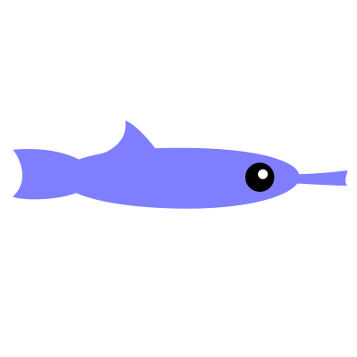</td>
  </tr>
  <tr>
    <td></td><td></td><td style="border-left: 1px solid #424346;">Assembly</td><td>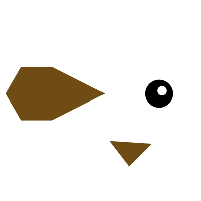</td><td style="border-left: 1px solid #424346;"></td><td></td>
  </tr>
</table>

Other languages will use one of the following models:

<table>
  <tr>
    <td>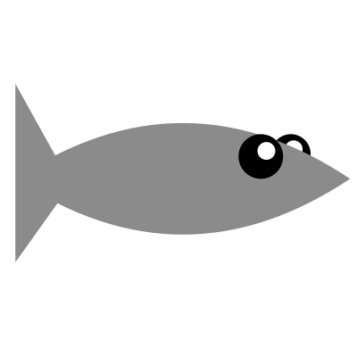</td>
    <td>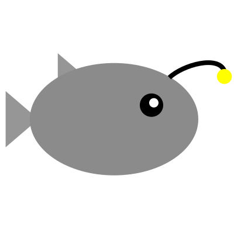</td>
    <td>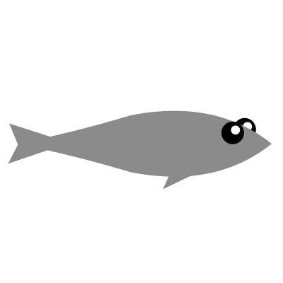</td>
    <td>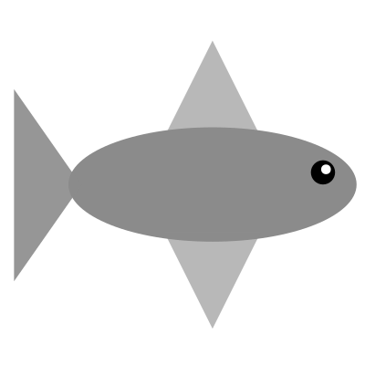</td>
    <td>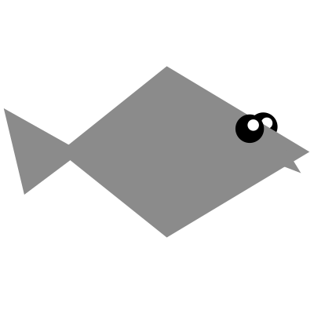</td>
  </tr>
</table>

## Screenshots
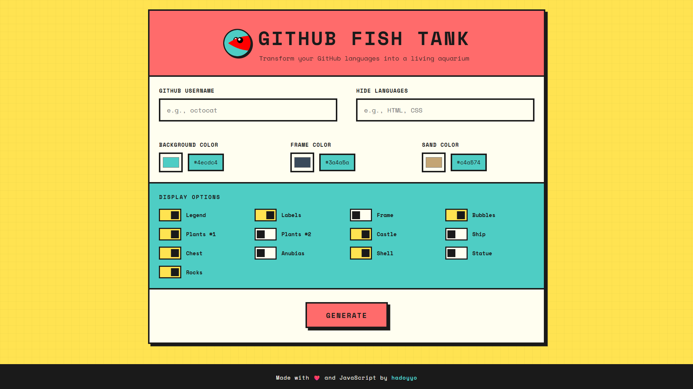
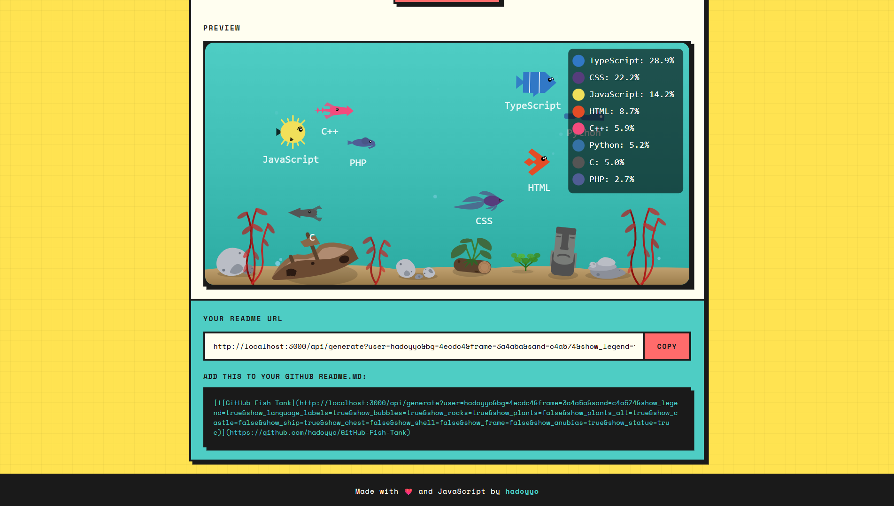

### Mobile Device
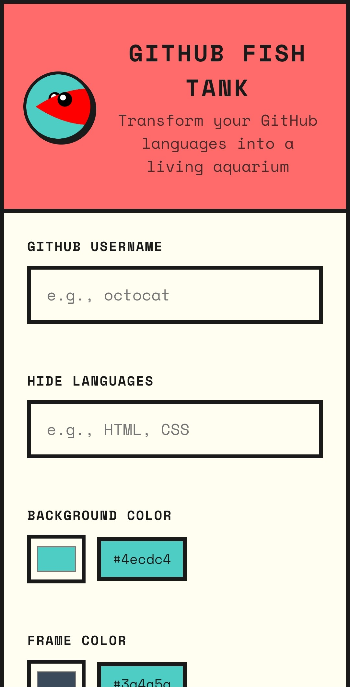 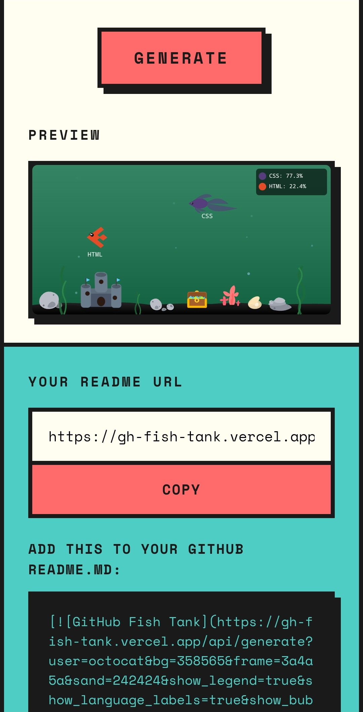
